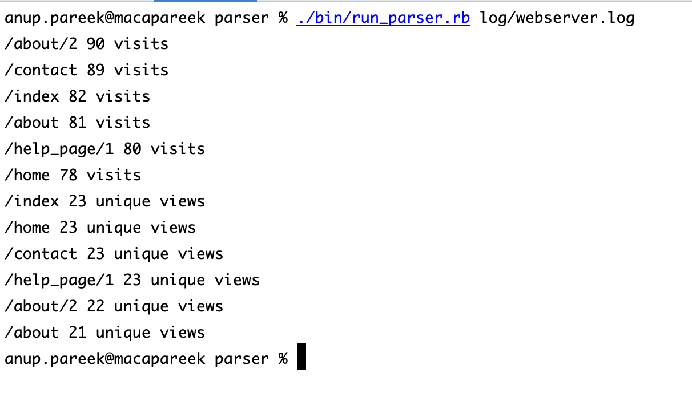

# Parser
Parse the given file and gives information about page view, etc.

# Output

# Design approach

* Segregated the responsibilities into separate classes.
  * `Parser::File` class to validate the file and read the file content.   
  * `Parser::LogContentParser` class parses the file content into domain related information.
  * `Parser::LogViewModel` class to render the response in asked format from client.
  * `Parser` top level layer to get the path, call all individual units and get the gives final output to client. This is like a workflow for this problem.

### Improvement scope
- File directory structure can be more organized.
- We can have separate class for sorting which is right now responsibility of view model.
- Naming convenstions can be improved.
